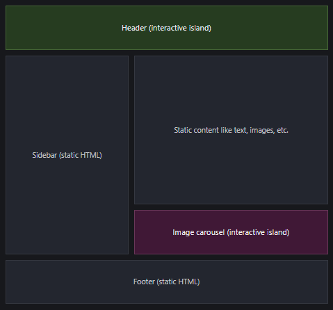
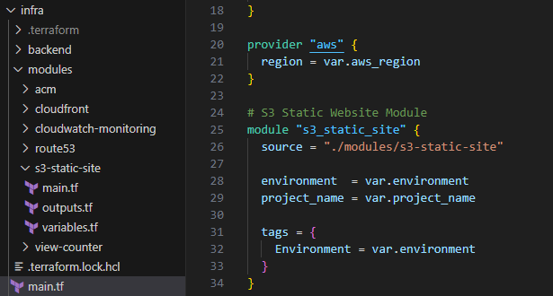

This website was designed following the pattern of the [Cloud Resume Challenge](https://cloudresumechallenge.dev/docs/the-challenge/aws/) from Forrest Brazeal. I've been eyeing this challenge for quite a while and it's now completed!

I decided to go beyond the original scope of the challenge by building from an Astro template that serves more than just a resume page. This site hosts my resume, but also blog posts and additional pages like my About section. I've also demonstrated dual test and production environments with full CI/CD pipelines using Terraform and GitHub Actions.

## Astro Web Framework ##

As a disclaimer, I'm not a front-end developer. This awesome Astro template was created by the user [Saica](https://github.com/saicaca). Many thanks and shoutout to them!

While developing this site though I wanted to understand the Astro framework and how it works under the hood. Both for educational purposes and also so I could make adjustments to the template to suit my needs. 

Astro is a static site generator that ships zero JavaScript to the browser by default. Instead it renders all components into static HTML at build time, dramatically improving page load performance, especially for content-heavy sites. It uses an "Islands" architecture where only interactive components (the islands) receive JavaScript, allowing the rest of the page to remain lightweight HTML and CSS. Interactive elements only hydrate when needed on the browser side. This way we get the performance of static sites, but still retain interactive components.
You can read more about it [here](https://docs.astro.build/en/concepts/why-astro/).



## Terraform Design Decisions ##

From the start, I needed to build this site's infrastructure with Terraform rather than provisioning resources manually through the AWS console. 

I organized all resources into reusable modules for two key reasons: first, to seamlessly integrate test and production deployments into the CI/CD pipeline, making environment promotion as simple as switching to the production backend and tfvars file. Second, I wanted to make this template easy for others to copy and modify. The modular design means anyone can grab this template and easily tweak it for their needs.



## CI/CD

I chose GitHub Actions for the CI/CD of this site for its simplicity and ease of use. The workflow handles the entire deployment pipeline in a single flow. First, it runs the pre-existing Astro build checks across Node.js versions 22 and 23 to ensure compatibility. Then, it builds the site, initializes the test S3 backend, and runs terraform apply using the test.tfvars variable file. Thanks to the modular Terraform design, the few variables listed in each variable file allow for deployment to the environment specific AWS resources.

Once the test environment is deployed, Python tests are run for the view counter, and a shell script runs some simple curl commands to ensure the site is accessible. This prompts a manual-approval gate. Once approved, the same steps occur, but with the production S3 backend and prod.tfvars file. At that point our site is live!

```yaml
- name: Terraform Init
  working-directory: infra
  run: terraform init -backend-config="backend/prod-backend.hcl"

- name: Terraform Apply
  working-directory: infra
  run: terraform apply -auto-approve -var-file="prod.tfvars"
```

[View the workflow here](https://github.com/kalebcastillo/cloud-portfolio/blob/main/.github/workflows/deploy.yml)

## GitHub CoPilot ##

One of my main goals with this project was to make extensive use of GitHub Copilot. I had never interacted with any code assistants before and wanted to explore both their power and limitations.

I found GitHub Copilot particularly useful while working with the Astro template. By providing context about existing features, I could ask for guidance on how to implement new ones, like adding a Resume page. Copilot also helped me fix pre-existing bugs, such as inconsistent sizing of blog post preview card images. Despite working with a pre-made template and lacking deep HTML and CSS expertise, I was able to effectively make the adjustments I needed on the front-end.

I also relied on Copilot while designing the Terraform structure. It generated module templates based on my specifications, which I could then refine by removing unnecessary variables, outputs, and simplifying the overall code structure.

I learned just as much about the limitations of coding assistants. Even with clear and detailed prompts, mistakes and inconsistencies were inevitable. Here are some key scenarios I encountered:

- Struggled to understand the full context of Astro's functionalities for generating certain site features
- Didn't recognize that we needed separate domains for test and production CloudFront distributions. I had to specify and adjust the code manually
- Suggested invalid CORS methods for CloudFront
- Had trouble parsing certain Terraform error messages from the terminal
- Generated overly verbose Terraform code that needed simplification
- Sometimes got stuck in circular logic without recognizing it, requiring me to clear its context and restart

These situations highlighted to me the importance of effective prompt engineering. I'm confident that with better context and more detailed prompts, I could have likely avoided many of these issues. I plan to expand my expertise on using AI assistants.

## Deployment Guide ## 

Check out my deployment guide for building your own site using the same Astro template and Terraform structure.

::github{repo="kalebcastillo/cloud-portfolio"}

## Final Thoughts

The Cloud Resume Challenge is an excellent project for anyone looking to get started learning cloud engineering. However, I'd strongly recommend building a solid foundation first. Before diving in, invest time in learning Linux fundamentals, cloud services, and essential developer tools like VSCode and Git/GitHub. 

I learned this myself. My first attempt at the challenge was overwhelming because I lacked these prerequisites. After spending a few months building these skills through other projects, I returned to the challenge with a much clearer understanding of what was needed. The second time around was significantly more enjoyable and productive. If you're considering this challenge, take the time to prepare thoroughly.

Thanks for reading!