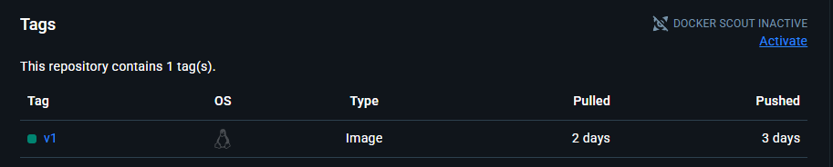

I've spent the last week or so diving into Docker, GitHub Actions, and Jenkins. After getting the basics down, I containerized a two-tier application and pushed the image to my Docker Hub repository. I then created a Jenkins pipeline that pulls from my GitHub repo, builds the new image from pushed code, pushes it to Docker Hub, and even sends me a nifty Discord notification upon a successful run!

## Dockerfile

The first step was to write a Dockerfile to containerize the application. I learned about how Docker images are made up of layers which are built on top of each other. Each instruction creates an immutable snapshot of an image, and together they form the final image. So we can utilize a pre-existing image to build our image with the FROM instruction. We'll also copy our application data into the image and define a command that will run a script. The script installs dependencies from requirements.txt and starts up our application.

## Docker Hub

Next was to create my own Docker Hub repository to store my images. Once created, I could tag the image I created locally and push it to my remote repository. Now, I had the ability to pull down the image from other tools/locations.

## GitHub Actions

Before delving into Jenkins, I wanted to first try creating a GitHub Action that would build my image. I learned that you don't necessarily have to define every single action in your steps. For common needs, you can reference prebuilt Actions from the GitHub marketplace. For the Docker build and push, I used this one: [docker-build-push-action](https://github.com/marketplace/actions/docker-build-push-action). I also had to create a GitHub environment variable for the username and a PAT for authentication.

## Jenkins

If you're interested in learning the basics of Jenkins too, I can vouch for this beginner's guide: [Learn Jenkins Course](https://www.youtube.com/watch?v=6YZvp2GwT0A) It proved to be a great intro.

### Creating the Server

I followed the official guide from the Jenkins site here on creating your own local Jenkins server via a Docker container: [Guide](https://www.jenkins.io/doc/book/installing/docker/). Once completed, you can log in to the GUI locally!

## Docker Cloud Agent

In this project, we've opted against permanent node agents and have instead configured a Docker Cloud agent. These are ephemeral, more easily scalable, and are becoming increasingly common in real world environments.

### Docker Host

We don't want the Jenkins controller to be responsible for actually provisioning the Docker Cloud agents. So, we first created a separate Docker container which uses socat to forward Docker socket communication. This acts as a bridge to the Docker daemon, allowing Jenkins to provision Docker Cloud agents. If you want to do the same, you can follow this guide [here](https://stackoverflow.com/questions/47709208/how-to-find-docker-host-uri-to-be-used-in-jenkins-docker-plugin).

### Docker Agent Image

Next was to create our own Docker agent image. This refers to the image that will run your pipeline. That being the case, the image will have to contain various packages and features. For example, in my case the image needed Docker CLI + buildx, Python to run tests, curl functionality to handle my notifications, etc. You can find the Dockerfile I used to create this image in my repo.

## grok | GitHub Webhook

Next I wanted to create a GitHub webhook that would allow Jenkins to listen for repo pushes and activate the pipeline accordingly. However, the Jenkins server needs to be accessible by GitHub for this. I opted to use Ngrok to create an accessible URL which forwards to my local Jenkins server. This would certainly not be considered a secure setup. A production environment would have a more robust configuration than this, but I've configured it this way only for testing purposes. 

At first, the webhook failed. The failure logs indicated crumbs were not being sent. Upon researching, I found that the webhook should be configured to point to **<jenkins-url>/github-webhook/**. After I adjusted the URL to include github-webhook, it worked.

## The Pipeline

Now we could create the actual CI/CD pipeline itself. You can find the Jenkinsfile in my repo, but here are some settings we configured for it on the Jenkins server side.

- Enable GitHub webhook trigger for GitSCM polling
- Pipeline definition: Pipeline script from SCM
- SCM: Git
- Repo URL: **my GitHub repo**
- Branch: **Specify correct branch**
- Path to the Jenkinsfile

## Discord Notification

Finally, I knew I wanted a Discord notification upon a successful pipeline run. This also required me to configure a webhook from Discord to my Jenkins server. Initially I accidentally used syntax meant for Slack! But after some tweaking, the notification went through.

## Challenges Faced

A few areas that initially confused and required additional research:

- Understand container layers
- Understanding the difference between Jenkins agent types
- SDLC concepts, especially as it pertains to CI/CD (Still in progress!)

## Project Improvements

When my Jenkins server is live, it's accessible over my Ngrok URL, which is not secure. For production, there are many options to make this secure. For example, configuring a public URL for the webhook and protecting the Jenkins server behind an Nginx reverse proxy.

As of now, the pipeline does not actually run tests on the application code, nor does it deploy the successfully built app image to any type of infrastructure. So, it's not quite a full-fledged CI/CD pipeline yet. I plan to learn Terraform next, and I have some additional studying to do on how testing works in SDLCs in general. So I'll be completing the other pipeline aspects at a later date (soon).

Thank you for reading!
