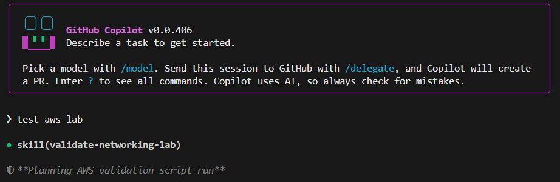

## Introduction

In July of 2025, I encountered [Learn to Cloud](https://learntocloud.guide/), an open-source, free cloud engineering courseware developed by [Gwyn Peña-Siguenza](https://www.linkedin.com/in/madebygps/) and [Rishab Kumar](https://www.linkedin.com/in/rishabkumar7/). As someone who was actively working toward transitioning to the cloud-native space, it was clear this was the perfect next step in my learning journey.

Over the next 6 months, I went through the material, built projects, studied for certifications, and made connections. Many of you know how that can be. The late-night hours, sitting at your desk at midnight feeling out of your depth, but pushing on anyway. During that time, I worked with the L2C team on developing updates to the programming capstone and incorporated new topics and hands-on tasks into existing phases. It was my first time ever contributing to open source, and it was incredibly fun and rewarding.

So, when I was asked to help work on the new version of Learn to Cloud, I was very excited. I would be serving as a Junior DevOps Engineer, helping to develop the CI/CD architecture, implement monitoring with Application Insights and Grafana, create networking and DevOps labs for AWS, and provide input on infrastructure and courseware design decisions.

I was able to refine technical skills and develop many new ones. But even more than that, I learned what goes into developing something that will actually go into production and will be used by thousands of people. It goes far beyond the tech itself. Architectural decisions, cost tradeoffs, working collaboratively in a team environment, and more, are all important. That's what I want to talk about in this blog.

## Decision Making, Tradeoffs

One of the most important things I learned is what happens before implementation. Decisions need to be made. Mostly due to cost concerns, but also in terms of application performance. Will you host the front-end as a static site, or run it in containers? Is a long-lived test environment really necessary for the scope of your project, or can you implement something ephemeral? What guardrails need to be in place to protect against over-consumption of tokens? These were real discussions we had before starting to build.

Along the way, things can certainly change. You can switch aspects of your infrastructure as needs evolve. But I learned the importance of discussing these considerations before even opening up your IDE.

There is also the decision of including or not including features. Just because you can implement a feature does not always mean you should. When discussing ideas for new content, we always made sure to consider the core philosophies of the course and how we intended learners to proceed through it.

## Delegation of Tasks

Everyone has different levels of expertise across different domains. It's important to delegate tasks appropriately according to that reality. For example, Gwyn, being a developer, is the creator and maintainer of the codebase supporting the Learn to Cloud application itself. Rishab, with his DevOps experience and GCP expertise, developed the IaC, internal monitoring platform, and GCP labs. As the Junior DevOps Engineer, I worked on the CI/CD architecture, Grafana dashboards, and AWS labs. This allowed us to work quickly, but also with accuracy, handling tasks according to our expertise.

Communication was also important. Maintaining daily check-ins with each other on progress and next steps helped to keep the project consistently moving in a forward direction.

## Team Environment

When working on a learning project, you know the entire scope and history of the project in your mind or perhaps in your notes. That's not the case in a team environment. Certain aspects now carry a lot more impact and affect collaboration, such as:
 
- Testing
- Documentation
- Organized branching and commits
- Detailed PRs 

Getting these basics right keeps everyone aligned and prevents small issues from snowballing later.

## Efficient Workflows

There are always opportunities to improve your workflow and be more efficient. One way in which we did this was to leverage Agent Skills heavily for testing and validation of our lab environments.

Iterating on lab environments can take time, and validating new or changed lab objectives can take even longer, especially when you are building for all of AWS, Azure, and GCP. Instead, we created Skills and told Copilot CLI to test our labs. It's smart enough to find what scripts to run from where, as long as you provide the proper instructions in your SKILL.md.

I found it beneficial to implement as many efficiencies as possible in your own workflow to improve the pace of the project.

## Senior to Junior Collaboration

When there is an open line of communication across engineering levels, more can get done on both sides. For example, Gwyn and Rishab consistently took my opinions into account and in various instances, even implemented my suggestions, despite me being new to the project. Likewise, if something I worked on was not quite right, they informed me why and steered me in the right direction.

Asking questions early and often can save time. Don't develop an entire feature, only to learn later it doesn't align with broader goals and decisions.

## Takeaways

Overall, my main takeaway from this experience was that much of the success of a project depends less on technical skills than you may think. They are necessary for sure, but there are so many skills and decisions beyond the technology itself that one should learn when working in an enterprise environment. I'm thankful to the L2C team for bringing me along in this process.

## Learn to Cloud

If you are reading this and are new to cloud engineering, I strongly recommend Learn to Cloud. I know it's good, because I used it myself to learn the skills required to help with this project! I truly believe it's the best resource to learn, thanks to the core philosophies of the courseware. It's designed not to handhold, but to simply guide. It's up to you as the learner to research further, troubleshoot problems, and decide which path you want to take in the cloud-native space.

learntocloud.guide

