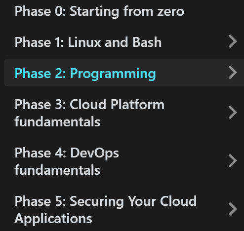
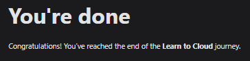
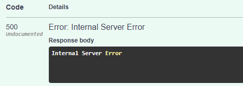
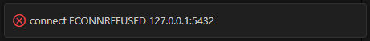
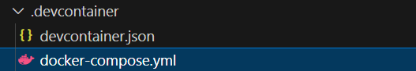
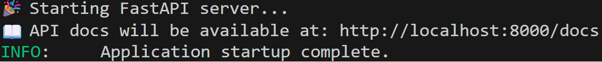
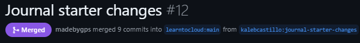
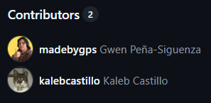

During July of this year, I decided to begin working through [Learn to Cloud](https://learntocloud.guide/), a popular Cloud Engineering courseware.

While working on the [Phase 2 Capstone Project](https://github.com/kalebcastillo/journal-starter), I encountered certain issues with the development environment. After working around them to complete the capstone, I decided to try my hand at resolving the issues and proposing the changes to the owners of the courseware. 

After much effort, my first Pull Request was reviewed and successfully merged into Learn to Cloud! I learned a great deal through this process and wanted to share the story.

## What is Learn to Cloud?

Learn to Cloud is an open-source roadmap and courseware designed to help aspiring Cloud Engineers gain the technical skills required for cloud-native roles.

I started Learn to Cloud because my goal is to transition to the cloud-native space. While I've been in IT for seven years now, I knew I had knowledge gaps to fill and plenty to learn.

The creators of Learn to Cloud, [Gwyn Peña-Siguenza](https://www.linkedin.com/in/madebygps/) and [Rishab Kumar](https://www.linkedin.com/in/rishabkumar7/), are two people in the space who started on the same path as myself. Getting that first entry-level IT Support job and diligently self-studying and up-skilling to improve their abilities over time. I knew a courseware designed by them and their team would accurately reflect the skills needed to be a strong engineer in Cloud.

## The Phases

Learn to Cloud is divided into six phases:

Each capstone builds upon the last. By the end of the course, you'll have completed a working API with Python, deployed it to the cloud, implemented DevOps methodologies towards it, and secured it to an enterprise-grade degree!

Phase 2, Programming, tackles Python fundamentals. It also introduces FastAPI, along with databases like Cosmos DB and PostgreSQL. The Phase 2 capstone involves working on a FastAPI + PostgreSQL codebase, completing development tasks to prepare the app for cloud deployment. 

## Working on the Capstone
Here are the issues I ran into when tackling the capstone.

### The Containers

The environment expected the PostgreSQL container to run via 'docker compose up' from within the Dev Container. When I ran the command, it failed and did not start up the DB container. After researching the error I received, I identified that the Dev Container would need to include the Docker-outside-of-Docker feature. After adding this feature, I could now start the DB container.

### The Database Connection

Now that both my containers were running, I began work on the development tasks. I wrote up the remaining API endpoints and started to test them on the FastAPI docs page. The endpoint requests failed and I was hit with error code 500.

I wasn't sure exactly where to go from here, so I decided to implement additional logging in the hopes that the logs could shed light on the issue. This was also a requirement of the capstone. I followed the guidance I found [here](https://betterstack.com/community/guides/logging/logging-with-fastapi/) to use Python's logging.config.dictConfig():

This did produce many more logs within my terminal, but I had a hard time reading them and interpreting them into information I could use to diagnose the issue. This was certainly a takeaway for myself for future reference.

Finally, I decided to install the PostgreSQL extension for VS Code to see if I could manually connect to my database and submit queries. I realized I could not connect to the database at all, receiving this error from the extension:

While researching this error, I discovered that one potential cause could be the database connection string. The string used localhost as the hostname for the database. Because the two docker containers were not within the same Docker network, the API could not connect to the database via this hostname.

Additionally, even though a database_setup.sql file was mounted into the container, because the connection string did not work, the database wasn’t being initialized and no schema was created.

## Resolving the Issues

I again got to researching. I read through various bits of information, but what really guided me was the official container.dev page on customizing your environment with Dockerfile and Docker Compose. This guide instructs you on how to incorporate Dev Containers with Docker Compose, and conveniently, the sample file includes a PostgreSQL database.

So, to resolve all the issues mentioned, I introduced a Docker Compose configuration that orchestrates both containers on the same Docker network.

- This eliminated the need for Docker-outside-of-Docker and allowed the containers to communicate cleanly.
- I updated the DATABASE_URL to use the database service name instead of localhost, which fixed the connection errors. Database creation is now automatic, with schema initialized from the .sql file.
- I defined environment variables in a .env file and added the "env_file" key to both containers within the Docker Compose file to ensure a consistent configuration.

After applying these changes, I made sure to test all functionalities to ensure full operability. Now, anyone could clone the project repo and get a working environment out of the box.

The Pull Request
I wanted to inform Gwen (or GPS) of my changes and propose updates to the official repo. So, I wrote up a technical Word document detailing everything and sent it over. 

This would be my first attempt at contributing to an open source project. I learned that while my technical document was useful, it would be better to officially submit an issue and pull request from the start on GitHub. I sent over my [issue](https://github.com/learntocloud/journal-starter/issues/11) and [pull request](https://github.com/learntocloud/journal-starter/pull/12).

GPS reviewed my request and sent back some comments for adjustments. In those comments she included the portions of the GitHub diff in question. I had never seen this formatting before, so it took me some time to understand the diff and apply the adjustments she was requesting. Another takeaway for continued learning.

After applying more tweaks to the repo, GPS reviewed and merged my Pull Request. I had officially contributed to Learn to Cloud!

It was a really great feeling. I saw how open-source collaboration is fun and rewarding. Seeing myself listed here was pretty cool, knowing that others will benefit from my efforts.

## Lessons Learned

While I did complete the capstone, upon reflection and looking back at my process, I learned a significant amount that I'll be able to apply in the future.

Submit detailed, readable Issues, written in Markdown. This will allow the repo owner to review them time-effectively. Pair those Issues with your Pull Requests. Reviewers should be able to easily track what Issues you're aiming to address with any changes you propose. All this will avoid adding extra friction to the code review process.

Keep your commit history clean, with descriptive messages. Create branches for each major feature addition. While you're in the middle of tackling a project and really focused, it can be tempting to be a bit reckless with your commits. The history of your repository should be clear and detailed.

Learn how to read and interpret various types of logs. For me, I know I want to practice reading FastAPI and database related logs in my terminal to allow for more effective troubleshooting.

## What’s Next

I'll be continuing my journey with Learn to Cloud. As mentioned, Phase 3 covers the actual cloud platforms, with myself focusing on Azure. In 2022, I acquired [my AZ-104 Certification](https://learn.microsoft.com/en-us/users/88112412/credentials/d5721d65e5867cba?ref=https%3A%2F%2Fwww.linkedin.com%2F), so this will be a great opportunity for me to resharpen my knowledge while learning about new features and best practices.

Learn to Cloud is always growing and evolving thanks to their dedicated team. I'm excited to stress-test it further and make more contributions if I identify further improvements that I can work on implementing.

## Projects

As for projects, I am an absolute basketball junkie. I watch more NBA games than what is probably healthy! I recently came across this seriously cool [Basketball Reference Web Scraper API](https://github.com/jaebradley/basketball_reference_web_scraper) created by Jae Bradley. 

I want to create something fun using this. It will provide me with a great opportunity to learn how to use an existing API, reading and interpreting the documentation so that I can incorporate the API into what I'm building.

I'm not sure yet which direction I will go. It will probably be focused around my favorite team, the OKC Thunder (and our recent championship 😉). If you love basketball and especially the Thunder as much as I do, perhaps follow [my GitHub](https://github.com/kalebcastillo) to catch what I work on.

Thanks for reading, and go learn how to Cloud! 🚀

::github{repo="kalebcastillo/journal-starter"}