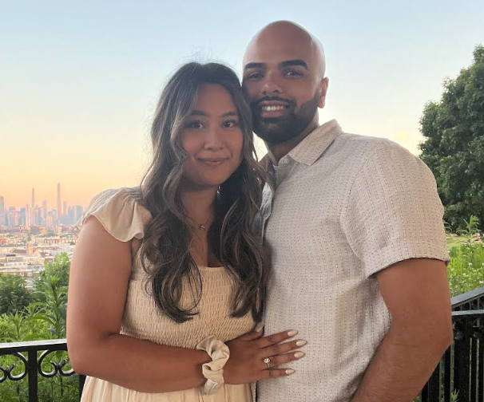

# About Me
Hey! I'm Kaleb. Welcome to my Cloud Portfolio site.

I've been working in IT since 2018. I got my start in the same way many people have. Getting my A+ certification and landing that first Help Desk role. Since then, I've always spent a good amount of my free time learning and trying to become a skilled IT professional. That led me to going down the networking route, attaining my CCNA and moving beyond the Help Desk. Later a desire to transition to Cloud led me to grab my AZ-104 and land a System Administrator role where I currently work today.

Some facts about me:
- Born and raised in Jersey City, where I still live with my fiancée
- I'm half Dominican, half Puerto Rican. AKA "Dominerican"
- I watch an unhealthy amount of basketball. My favorite NBA team is the OKC Thunder. (CHAMPS)
- I did sleep in front of MicroCenter to get a RTX 3080 during the GPU chip shortage...

In 2025 I've been motivated to transition into the more cloud-native space, which has guided me toward learning the skills required to become a full-on Cloud/DevOps Engineer. I've delved into Linux, Python, API's, Databases, Docker, Kubernetes, DevOps methodologies, and more. This site serves as live project which represents a culmination of a lot of the skills I've learned thus far.

Check out the repo for this site here, which contains a deployment guide if you want to deploy your own site with the same Terraforma and Astro template.

::github{repo="kalebcastillo/cloud-portfolio"}

A techincal blog is on the way as well.

Thanks for visiting!
